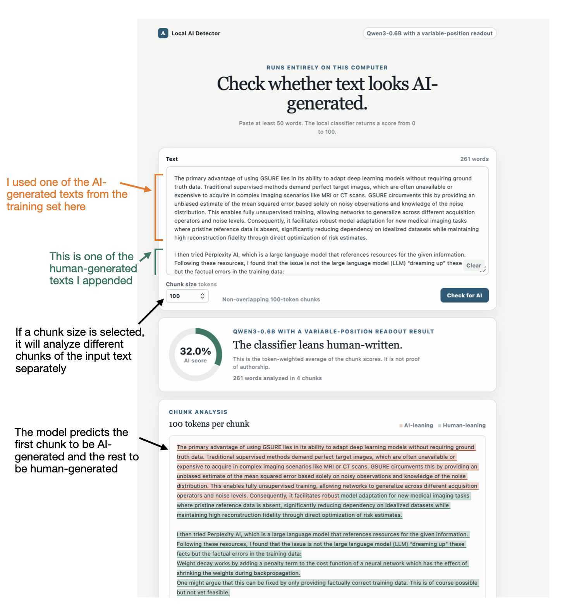

&nbsp;
# Build an AI Text Detector From Scratch

This repository contains the code accompanying my article
[Build an AI Text Detector From Scratch](https://magazine.sebastianraschka.com/p/ai-detector-from-scratch).
It starts with dataset construction, compares several classifier architectures,
and ends with experiments that use the detector as a verifier during
reinforcement learning.

The detector is a binary classifier. Given a text, it returns a score from 0
to 100, where larger values indicate that the model considers the text more
likely to be AI-generated. This score reflects the classifier and its training
distribution. It is not proof that a particular text was written by a human or
an AI system.

&nbsp;
## Repository guide

The numbered folders under `scripts` follow the order of the accompanying
project:

| Stage | Folder | Contents |
|---|---|---|
| 01 | [Human data](scripts/01_human-data/) | Data gen 1: Licensed human-text collection |
| 02 | [AI data](scripts/02_ai-data/) | Data gen 2: AI-text generation and Pangram checks |
| 03 | [AI-assisted data](scripts/03_ai-assisted-data/) | Data gen 3: Light and moderate AI editing |
| 04 | [Hugging Face dataset](scripts/04_hf-dataset/) | Dataset conversion and grouped splits |
| 05 | [Logistic regression](scripts/05_logreg-baseline/) | TF-IDF baseline, calibration, and export |
| 06 | [ChatGPT baseline](scripts/06_chatgpt-baseline/) | API-based classification benchmark |
| 07 | [DistilBERT](scripts/07_distilbert/) | Full DistilBERT fine-tuning |
| 08 | [DistilBERT LoRA and MiCA](scripts/08_distilbert-lora/) | Parameter-efficient fine-tuning |
| 09 | [ModernBERT](scripts/09_modernbert/) | ModernBERT fine-tuning |
| 10 | [GPT-2](scripts/10_gpt2/) | GPT-2 fine-tuning |
| 11 | [Qwen3](scripts/11_qwen3/) | Qwen3 fine-tuning |
| 12 | [Length bias](scripts/12_length-bias/) | Score and error analysis by text length |
| 13 | [Learning curves](scripts/13_learning-curves/) | Training-set size experiments |
| 14 | [Resource and latency](scripts/14_resource-latency/) | Throughput, latency, and memory benchmarks |
| 15 | [Classifier API](scripts/15_classifier-api/) | Model downloads, CLI, and local server |
| 16 | [Substack case study](scripts/16_case-study-substack/) | Evaluation on labeled Substack notes |
| 17 | [Browser UI](scripts/17_browser-ui/) | Local React and FastAPI interface |
| 18 | [Reinforcement learning](scripts/18_reinforcement-learning/) | Detector-as-verifier RLVR experiments |

The reusable inference code is in [`src/ai_detector`](src/ai_detector/), and
the repository checks are in [`tests`](tests/). Stages with additional setup
or usage details include their own README.

&nbsp;
## Setup

The project uses Python 3.12 and [uv](https://docs.astral.sh/uv/). After
cloning the repository, install the minimal dependencies for downloading and
running the logistic regression detector with:

```bash
uv sync
uv run python environment_check.py
```

Install only the additional groups needed for the part of the project you
want to run:

```bash
# DistilBERT, ModernBERT, GPT-2, Qwen3, LoRA, and MiCA inference
uv sync --group transformer-inference

# Model training and dataset utilities
uv sync --group training

# Jupyter notebooks and plotting
uv sync --group notebooks

# FastAPI server and browser UI
uv sync --group browser-ui

# Complete contributor environment, including tests
uv sync --group dev
```

Groups are additive to the minimal environment. For example, use `uv sync
--group transformer-inference --group browser-ui` to run the browser UI with
a transformer detector.

Some of the training notebooks require a CUDA GPU. The dataset-generation
scripts also use external APIs or a local Ollama server, depending on the
selected model. The individual stage READMEs list these requirements where
needed.

&nbsp;
## Quick start

The fastest way to try the detector is the logistic regression baseline.
First, download its trained artifact from the Hugging Face Hub:

```bash
uv run python scripts/15_classifier-api/download-models.py \
  --fetch \
  --model logreg
```

Then classify a text:

```bash
uv run python scripts/15_classifier-api/classify.py \
  --model logreg \
  --text "Paste the text to classify here."
```

The command returns a JSON payload such as:

```json
{"score": 72.4138}
```

The same interface supports the DistilBERT, ModernBERT, GPT-2, and Qwen3
classifiers after their model artifacts have been downloaded. See
[`scripts/15_classifier-api`](scripts/15_classifier-api/README.md) for the
complete model list and examples for files, standard input, and the local
server.

&nbsp;
## Browser UI

Stage 17 provides a local browser interface for the trained classifiers. The
selected model is loaded once when the server starts and kept in memory for
subsequent checks.

By default, the UI scores the complete input. You can also choose a chunk size,
such as 100 tokens, to analyze non-overlapping sections independently. This
makes it possible to inspect which parts of a longer text lean AI-generated or
human-written according to the selected classifier.



After completing the one-time frontend setup described in the
[`scripts/17_browser-ui`](scripts/17_browser-ui/README.md) README, start the
interface with:

```bash
uv run python scripts/17_browser-ui/app.py \
  --model qwen3-variable \
  --device auto
```

Then open [http://127.0.0.1:8000](http://127.0.0.1:8000).

&nbsp;
## Dataset

The experiments use the
[`rasbt/human-vs-ai-50k`](https://huggingface.co/datasets/rasbt/human-vs-ai-50k)
dataset. It contains 25,355 human-written texts and 25,355 AI-generated texts
with grouped training, validation, and test splits. Source documents and AI
texts derived from them remain in the same split to reduce source leakage.

The raw text files and generated model weights are excluded from Git. The
numbered data stages document how to recreate the dataset, while the stage-15
download script retrieves the published model artifacts.

The reusable inference implementation lives in `src/ai_detector`. The
numbered folders keep the data collection, training, evaluation, and
application code aligned with the project stages.

&nbsp;
## Reproducing the experiments

For a complete reproduction, follow the numbered folders in order. You can
skip directly to an individual model or analysis when the Hugging Face dataset
and required model artifacts are already available.

The full data-generation and training pipeline is substantially more
expensive than the quick-start example. It uses several language models,
external API calls, and GPU training runs. For most readers, the published
dataset and model artifacts are the more practical starting point.

&nbsp;
## License

The code in this repository is available under the license in
[`LICENSE`](LICENSE). The dataset combines material with several source
licenses. Its row-level metadata records the applicable source and license
information.
